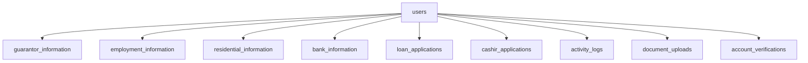

## Overview

The Rihsac API uses Laravel migrations to manage the database schema. This guide covers how to run migrations and provides an overview of the database structure.

## Running Migrations

<Steps>
  <Step title="Create Database">
    First, create the database specified in your `.env` file:
    
    ```sql
    CREATE DATABASE laravel CHARACTER SET utf8mb4 COLLATE utf8mb4_unicode_ci;
    ```
  </Step>

  <Step title="Run Migrations">
    Execute all pending migrations:
    
    ```bash
    php artisan migrate
    ```
    
    This will create all required tables in your database.
  </Step>

  <Step title="Verify Migration Status">
    Check which migrations have been run:
    
    ```bash
    php artisan migrate:status
    ```
  </Step>
</Steps>

<Warning>
  Running migrations in production requires caution. Always backup your database before running migrations in production environments.
</Warning>

## Migration Commands

### Fresh Migration

Drop all tables and re-run all migrations:

```bash
php artisan migrate:fresh
```

<Warning>
  This command will destroy all data in your database. Only use in development.
</Warning>

### Rollback Migrations

Rollback the last batch of migrations:

```bash
php artisan migrate:rollback
```

Rollback all migrations:

```bash
php artisan migrate:reset
```

### Migration with Seeding

Run migrations and seed the database:

```bash
php artisan migrate --seed
```

## Database Schema

### User Management

#### Users Table

The core user table stores user account information:

```php
Schema::create('users', function (Blueprint $table) {
    $table->id();
    $table->uuid('uuid');
    $table->string('firstname')->nullable();
    $table->string('lastname')->nullable();
    $table->string('email')->unique()->nullable();
    $table->string('password');
    $table->string('username')->unique()->nullable();
    $table->string('phone_number')->unique()->nullable();
    $table->string('state_id')->nullable();
    $table->string('cashir_id')->unique()->nullable();
    $table->boolean('email_verified')->default(false);
    $table->boolean('phone_number_verified')->default(false);
    $table->enum('role',['USER', 'ADMIN', 'SUPERADMIN']);
    $table->string('transaction_pin')->nullable();
    $table->string('avatar')->nullable();
    $table->string('onboarding_stage');
    $table->enum('status', ['enabled', 'disabled'])->default('disabled');
    $table->rememberToken();
    $table->timestamps();
});
```

**Key Fields:**
- `uuid`: Unique identifier for external references
- `cashir_id`: Unique identifier for the Cashir system
- `role`: User role (USER, ADMIN, SUPERADMIN)
- `onboarding_stage`: Tracks user onboarding progress
- `email_verified` / `phone_number_verified`: Verification status
- `status`: Account status (enabled/disabled)

#### Password Resets Table

Stores password reset tokens:

```php
Schema::create('password_resets', function (Blueprint $table) {
    $table->string('email')->index();
    $table->string('token');
    $table->timestamp('created_at')->nullable();
});
```

#### Activation Tokens Table

Manages email and phone verification tokens:

```php
Schema::create('activation_tokens', function (Blueprint $table) {
    $table->id();
    $table->string('email');
    $table->string('code');
    $table->string('type');
    $table->timestamps();
});
```

### User Profile Information

#### Guarantor Information Table

Stores guarantor details for loan applications:

```php
Schema::create('guarantor_information', function (Blueprint $table) {
    $table->id();
    $table->uuid('uuid');
    $table->integer('user_id');
    $table->string('firstname');
    $table->string('lastname');
    $table->string('phone_number');
    $table->string('email');
    $table->integer('relationship');
    $table->timestamps();
});
```

#### Employment Information Table

Stores user employment and financial details:

```php
Schema::create('employment_information', function (Blueprint $table) {
    $table->id();
    $table->uuid('uuid');
    $table->integer('user_id');
    $table->integer('employment_status');
    $table->integer('number_of_dependents');
    $table->string('monthly_income');
    $table->string('monthly_savings');
    $table->string('monthly_expense');
    $table->timestamps();
});
```

#### Residential Information Table

Stores user residential details:

```php
Schema::create('residential_information', function (Blueprint $table) {
    $table->id();
    $table->uuid('uuid');
    $table->integer('user_id');
    $table->integer('apartment_type');
    $table->integer('ownership');
    $table->timestamps();
});
```

#### Bank Information Table

Stores user banking details:

```php
Schema::create('bank_information', function (Blueprint $table) {
    $table->id();
    $table->uuid('uuid');
    $table->integer('user_id');
    $table->string('bank_name');
    $table->string('account_number');
    $table->string('account_name');
    $table->string('bvn');
    $table->timestamps();
});
```

<Warning>
  Bank information including BVN (Bank Verification Number) is sensitive data. Ensure proper encryption and security measures are in place.
</Warning>

### Loan Management

#### Loan Applications Table

Manages loan applications:

```php
Schema::create('loan_applications', function (Blueprint $table) {
    $table->id();
    $table->uuid('uuid');
    $table->integer('user_id');
    $table->string('amount');
    $table->string('location');
    $table->string('currency');
    $table->enum('status', ['PENDING', 'REJECTED', 'APPROVED', 'DISBURSED']);
    $table->longText('other_information');
    $table->longText('loan_history');
    $table->timestamps();
});
```

**Loan Status Flow:**
- `PENDING`: Initial application state
- `APPROVED`: Loan approved by admin
- `REJECTED`: Loan rejected
- `DISBURSED`: Funds released to user

#### Cashir Applications Table

Manages Cashir-specific loan applications:

```php
Schema::create('cashir_applications', function (Blueprint $table) {
    $table->id();
    $table->uuid('uuid');
    $table->integer('user_id');
    $table->string('amount');
    $table->string('tenor');
    $table->enum('status', ['PENDING', 'REJECTED', 'APPROVED', 'DISBURSED']);
    $table->longText('other_information');
    $table->longText('loan_history');
    $table->timestamps();
});
```

<Note>
  Cashir applications include a `tenor` field representing the loan repayment period.
</Note>

#### Payment Channels Table

Manages payment channel configurations (see migration file for details).

#### Cashir Transactions Table

Tracks all financial transactions in the system (see migration file for details).

### System Tables

#### Settings Table

Stores system configuration values:

```php
Schema::create('settings', function (Blueprint $table) {
    $table->id();
    $table->uuid('uuid');
    $table->string('name')->unique();
    $table->enum('type', ['Apartment', 'Ownership', 'Employment', 'Relationship']);
    $table->enum('status', ['disabled', 'enabled'])->default('enabled');
    $table->timestamps();
});
```

Used for storing enumerated values like apartment types, employment statuses, etc.

#### Activity Logs Table

Tracks user activities:

```php
Schema::create('activity_logs', function (Blueprint $table) {
    $table->id();
    $table->integer('user_id');
    $table->string('message');
    $table->string('type');
    $table->timestamps();
});
```

#### Account Verifications Table

Tracks account verification status:

```php
Schema::create('account_verifications', function (Blueprint $table) {
    $table->id();
    $table->uuid('uuid');
    $table->integer('user_id');
    $table->timestamps();
});
```

#### Document Uploads Table

Manages user document uploads:

```php
Schema::create('document_uploads', function (Blueprint $table) {
    $table->id();
    $table->integer('user_id');
    $table->string('upload_type');
    $table->string('id_card_type');
    $table->string('document_path');
    $table->string('document_name');
    $table->timestamps();
});
```

#### Personal Access Tokens Table

Manages Laravel Sanctum tokens (if using token-based authentication alongside JWT).

#### Failed Jobs Table

Stores failed queue jobs for retry and debugging.

## Database Relationships

Key relationships in the database:



All profile and application tables reference the `users` table via `user_id`.

## Best Practices

<Note>
  **UUID Usage**: Most tables include a `uuid` field for external API references. Use UUIDs in API responses instead of auto-incrementing IDs to prevent enumeration attacks.
</Note>

### Indexing

Ensure proper indexes are in place for frequently queried fields:

```sql
CREATE INDEX idx_user_id ON loan_applications(user_id);
CREATE INDEX idx_status ON loan_applications(status);
```

### Data Integrity

Consider adding foreign key constraints in production:

```php
$table->foreignId('user_id')
      ->constrained()
      ->onDelete('cascade');
```

## Troubleshooting

### Migration Fails

If a migration fails:

1. Check the error message carefully
2. Verify database connection in `.env`
3. Ensure the database user has proper permissions
4. Check for duplicate table names or columns

### Rollback Issues

If rollback fails:

```bash
# Check migration status
php artisan migrate:status

# Force rollback if needed
php artisan migrate:rollback --force
```

## Next Steps

<CardGroup cols={2}>
  <Card title="Environment Setup" icon="gear" href="/guides/environment-setup">
    Configure your development environment
  </Card>
  <Card title="API Reference" icon="code" href="/api-reference/introduction">
    Explore available API endpoints
  </Card>
</CardGroup>